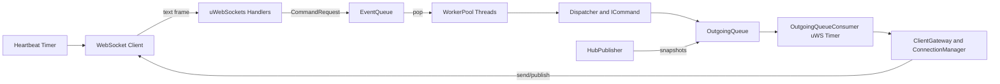

# Serverless Communication

Modern C++20 real‑time messaging server built on uWebSockets, a worker/queue pipeline, and PostgreSQL persistence. The codebase shows how to wire a lightweight alternative to chat/voice backends: it accepts WebSocket connections, validates and dispatches commands on worker threads, and fans messages back to clients through a cross-thread outgoing queue.

## 1. Project Overview
- **What it is:** WebSocket server with a dispatcher/worker architecture for hub/channel style messaging. Components are transport-agnostic on the application side and isolated from the uWS networking layer.
- **Problem it solves:** Decouples network I/O from business logic so command handling, persistence, and fan-out can scale independently. Provides clean entry points for authentication, hub/channel membership, and presence.
- **Tech stack:** C++20, Bazel, uWebSockets/usockets, nlohmann/json, pqxx (PostgreSQL), redis++ (connectivity check), optional TLS via compile-time flag.

## 2. Features
- Real-time WebSocket messaging with per-connection metadata (`PerSocketData`) and heartbeat/ping handling.
- Worker-pool backed queue system: inbound events (commands, disconnects) → workers → dispatcher → outgoing queue → consumer on the uWS loop.
- Message validation (shape, size, profanity/pattern checks) tied to registered commands.
- Hub/channel snapshot publisher that periodically republishes online status and membership.
- PostgreSQL persistence via a connection pool and repositories (hubs, channels, users).
- In-memory pub/sub for topic fan-out plus per-connection direct messaging.
- Graceful start/stop with signal handling; daemon-like background threads for workers, heartbeat, hub publisher, and outgoing consumer.

## 3. Architecture
- **Threading model:**  
  - uWS event loop thread: accepts sockets, enqueues inbound events, runs timers (heartbeat, outgoing consumer).  
  - Worker threads: `WorkerPool` pops events from `EventQueue`, validates, dispatches commands, and enqueues outgoing messages.  
  - Background worker: `HubPublisher` periodically pushes hub snapshots to the outgoing queue.
- **Queue system:**  
  - `EventQueue` (blocking) moves `CommandRequest`/`DisconnectEvent` from network to workers.  
  - `OutgoingQueue` (non-blocking pop) moves `DirectMessage`/`PublishMessage` from workers/publishers to the uWS loop.
- **Message flow:** WebSocket frame → `CommandRequest` → `EventQueue` → worker validates (`MessageValidator`) → `Dispatcher` invokes `ICommand` → emits `OutgoingMessage` → `OutgoingQueue` → `OutgoingQueueConsumer` sends via `ClientGateway`.
- **Network I/O:** uWebSockets handles upgrade/open/message/close; `ConnectionManager` maps connection IDs to sockets; `ClientGateway` sends direct or topic-based messages and tracks pub/sub topics.
- **Directory layout (selected):**
  - `core/` app factory, config, uWS wrappers, process lifecycle.
  - `net/` WebSocket plumbing, connection management, heartbeat, outgoing consumer.
  - `app/` dispatcher, commands, services, worker pool, queues, pub/sub.
  - `infra/` persistence (pqxx pool, repositories), security validation.
  - `domains/` pure models and ID types.
  - `utils/` env loading, logging, TLS config, helpers.



## 4. Build Instructions
**Dependencies**
- Bazel 7+ (Bzlmod enabled).
- System libs: `libpqxx-dev`, `libpq-dev` (see `system_requirements.txt`).
- Optional: Redis reachable at `REDIS_HOST`/`REDIS_PORT` for the startup connectivity check.

**Environment** (`.env` or process env; defaults in `core/ServerConfig.h`)
```
SERVER_HOST=0.0.0.0
SERVER_PORT=9001
SOCKET_PATTERN=/*
DB_ENGINE=postgresql
DB_USER=postgres
DB_PASSWORD=password
DB_HOST=localhost
DB_PORT=5432
DB_NAME=postgres
DB_POOL_SIZE=3
REDIS_HOST=localhost
REDIS_PORT=6379
```

**Build**
```
bazel build //app:server_app
```
- Enable TLS assets in `certs/` with `--define USE_SSL=true` (links SSL, checks cert/key paths).

**Run**
```
# Plain (no TLS)
bazel run //app:server_app

# With TLS compile-time flag (expects certs/key.pem, certs/cert.pem)
bazel run //app:server_app --define USE_SSL=true
```
The binary loads `.env`, pings Redis, builds the server, and listens on `SERVER_HOST:SERVER_PORT`.

## 5. Code Highlights
- **Queueing from WebSocket to workers** (`net/WebSocketServer.cpp`)
```cpp
CommandRequest req;
req.payload = std::string{data};
req.conn_id = psd->conn_id;
req.user_id = psd->user_id;
req.current_hub_id = psd->current_hub_id;
req.current_channel_id = psd->current_channel_id;
req.authenticated = psd->authenticated;
req.received_at = std::chrono::system_clock::now();
in_q_.push(Event{req});
```

- **Worker thread dispatch** (`app/worker/WorkerPool.cpp`)
```cpp
Event evt;
while (running_) {
    wait_if_paused();
    if (!in_queue_.pop(evt)) break;

    std::visit([&](auto&& arg) {
        if constexpr (std::is_same_v<std::decay_t<decltype(arg)>, CommandRequest>) {
            auto [valid, err, err_code, message, _] = message_validator_.validate_message(arg.payload);
            if (!valid) return send_error(arg, err_code, err);

            CommandContext ctx{arg.conn_id, arg.user_id, arg.current_hub_id,
                               arg.current_channel_id, arg.authenticated, {message}, {}};
            dispatcher_.dispatch(ctx.input.data["type"], ctx);
            for (auto& msg : ctx.output.messages) out_queue_.push(std::move(msg));
        }
    }, evt.payload);
}
```

- **Consuming outgoing messages on the uWS loop** (`net/OutgoingQueueConsumer.cpp`)
```cpp
if (auto opt = out_q_.try_pop()) {
    std::visit([&](auto&& arg) {
        using T = std::decay_t<decltype(arg)>;
        if constexpr (std::is_same_v<T, DirectMessage>) {
            if (auto* ws = conns_.get(arg.conn_id)) {
                if (arg.apply_psd) arg.apply_psd(ws->getUserData());
                cli_gtw_.send_defer(arg.conn_id, json::parse(arg.payload));
            }
        } else if constexpr (std::is_same_v<T, PublishMessage>) {
            cli_gtw_.publish(arg.topic, arg.payload);
        }
    }, *opt);
}
```

- **Background hub snapshot publishing** (`app/services/HubPublisher.h`)
```cpp
void publish_hub(const HubId& hub_id) {
    std::lock_guard<std::mutex> lk(mu_);
    dirty_hubs_.insert(hub_id);
    cv_.notify_all();
}
```

## 6. Roadmap
- Only the `auth` command is currently active; other hub/channel/message commands exist but are commented while the architecture is adapted—re-enable and register them after refactor.
- Redis is only pinged at startup; planned to power pub/sub and low-latency fan-out to reduce direct database load.
- TLS support exists behind `USE_SSL`, but cert/key management and runtime configuration are minimal.
- Tests are sparse; expand coverage around message validation, worker dispatch outcomes, and repository persistence.
- Rate limiting, security policies, and richer authorization hooks are scaffolded but not wired end-to-end.

## 7. License & Credits
- License: To be added
